# Bienvenue sur Joplin!

Joplin is a free, open source note taking and to-do application, which helps you write and organise your notes, and synchronise them between your devices. The notes are searchable, can be copied, tagged and modified either from the application directly or from your own text editor. The notes are in [Markdown format](https://joplinapp.org/help/#markdown). Joplin is available as a **desktop**, **mobile** and **terminal** application.

The notes in this notebook give an overview of what Joplin can do and how to use it. In general, the three applications share roughly the same functionalities; any differences will be clearly indicated.


## Joplin is divided into three parts

Joplin has three main columns:

- **Sidebar** contains the list of your notebooks and tags, as well as the synchronisation status.

- **Note List** contains the current list of notes - either the notes in the currently selected notebook, the notes in the currently selected tag, or search results.

- **Note Editor** is the place where you write your notes. There is a **Rich Text editor** and a **Markdown editor** - click on the **Toggle editor** button in the top right hand corner to switch between both! You may also use an [external editor](https://joplinapp.org/help/#external-text-editor) to edit notes. For example you can use Typora as an external editor and it will display the note as well as any embedded images.
         

Donate using PayPal Sponsor on GitHub Become a patron Donate using IBAN
Markdown Guide🔗

Markdown is a simple way to format text that looks great on any device. It doesn't do anything fancy like change the font size, color, or type — just the essentials, using keyboard symbols you already know. Since it is plain text, it is an easy way to author notes and documents and when needed it can be converted to a rich text HTML document.

Joplin desktop and mobile applications can display both the Markdown text and the rendered rich text document.

Joplin follows the CommonMark specification, with additional features added via plugins.
Cheat Sheet🔗

This is a quick summary of the Markdown syntax.
	Markdown 	Rendered Output
Heading 1 	

# Heading 1

	
Heading 1
Heading 2 	

## Heading 2

	
Heading 2
Heading 3 	

### Heading 3

	
Heading 3
Bold 	

This is some **bold text**

	This is some bold text
Italic 	

This is some *italic text*

	This is some italic text
Blockquotes 	

> Kent.
> Where's the king?

> Gent.
> Contending with the
> fretful elements

	

    Kent.
    Where's the king?

    Gent.
    Contending with
    the fretful elements

List 	

* Milk
* Eggs
* Beers
    * Desperados
    * Heineken
* Ham

	

    Milk
    Eggs
    Beers
        Desperados
        Heineken
    Ham

Ordered list 	

1. Introduction
2. Main topic
    1. First sub-topic
    2. Second sub-topic
3. Conclusion

	

    Introduction
    Main topic
        First sub-topic
        Second sub-topic
    Conclusion

Inline code 	

This is `someJavaScript()`

	This is someJavaScript()
Code block 	

Here's some JavaScript code:

```
function hello() {
    alert('hello');
}
```

Language is normally auto-detected,
but it can also be specified:

```sql
SELECT * FROM users;
DELETE FROM sessions;
```

	Here's some JavaScript code:

function hello() {
    alert('hello');
}


Language is normally auto-detected, but it can also be specified:

SELECT * FROM users;
DELETE FROM sessions;

Unformatted text 	

Indent with a tab or 4 spaces
for unformatted text.

    This text will not be formatted:

    Robert'); DROP TABLE students;--

	Indent with a tab or 4 spaces for unformatted text.

This text will not be formatted:

Robert'); DROP TABLE students;--

Link 	

This is detected as a link:

https://joplinapp.org

And this is a link anchoring text content:

[Joplin](https://joplinapp.org)

And this is a link, with a title,
anchoring text content:

[Joplin](https://joplinapp.org "Joplin project page")

	This is detected as a link:

https://joplinapp.org

And this is a link anchoring text content:

Joplin

And this is a link, with a title,
anchoring text content:

Joplin (hint: hover over the link)
Images 	


	Here's Joplin icon
Horizontal Rule 	

One rule:
***
Another rule:
---

	One rule:
Another rule:
Tables 	See below 	
Tables🔗

Tables are created using pipes | and and hyphens -. This is a Markdown table:

| First Header  | Second Header |
| ------------- | ------------- |
| Content Cell  | Content Cell  |
| Content Cell  | Content Cell  |

Which is rendered as:
First Header 	Second Header
Content Cell 	Content Cell
Content Cell 	Content Cell

Note that there must be at least 3 dashes separating each header cell.

Colons can be used to align columns:

| Tables        | Are           | Cool  |
| ------------- |:-------------:| -----:|
| col 3 is      | right-aligned | $1600 |
| col 2 is      | centered      |   $12 |

Which is rendered as:
Tables 	Are 	Cool
col 3 is 	right-aligned 	$1600
col 2 is 	centered 	$12
Joplin Extras🔗

Besides the standard Markdown syntax, Joplin supports several additional features.
Links to other notes🔗

You can create a link to a note by specifying its ID in the URL. For example:

[Link to my note](:/0b0d62d15e60409dac34f354b6e9e839)

Since getting the ID of a note is not straightforward, each app provides a way to create such link. In the desktop app, drag and drop a note into another note to create a link. Or right click on a note and select "Copy Markdown link". In the mobile app, open a note and, in the top right menu, select "Copy Markdown link". You can then paste this link anywhere in another note.
Math notation🔗

Math expressions can be added using the KaTeX notation. To add an inline equation, wrap the expression in $EXPRESSION$, eg. $\sqrt{3x-1}+(1+x)^2$. To create an expression block, wrap it as follow:

$$
EXPRESSION
$$

For example:

$$
f(x) = \int_{-\infty}^\infty
	\hat f(\xi)\,e^{2 \pi i \xi x}
	\,d\xi
$$





```mermaid
flowchart LR
  subgraph OPNSense
        direction TB
        P1{10.99.99.1<br />à destination} <--> W[192.168.1.27<br />web<br />10.98.1.2]
        P1 <--> I1[intranet<br />192.168.1.27]		
  end
  A[serveur Web<br />10.99.99.10] <--> P1
  W <==> |VPN| OVH[10.98.1.1<br />OVH<br />123.123.123.123]
  I1 <-..-> E[client intranet<br />192.168.1.66]
  OVH <-.-> F[client web]
```

- [ ] Milk,[^1]
- [x] Rice
- [ ] Eggs

[^1]: ici une note de bas de page (mais elle se retrouve en bas de la page)


## Writing notes in Markdown

Markdown is a lightweight markup language with plain text formatting syntax. Joplin supports a [Github-flavoured Markdown syntax](https://joplinapp.org/markdown/) with a few variations and additions.

In general, while Markdown is a markup language, it is meant to be human readable, even without being rendered. This is a simple example (you can see how it looks in the viewer panel):

* * *

# Heading

## Sub-heading

Paragraphs are separated by a blank line. Text attributes _italic_, **bold** and `monospace` are supported. You can create bullet lists:

* apples
* oranges
* pears

Or numbered lists:

1. wash
2. rinse
3. repeat

This is a [link](https://joplinapp.org) and, finally, below is a horizontal rule:

* * *

A lot more is possible including adding code samples, math formulae or checkbox lists - see the [Markdown documentation](https://joplinapp.org/help/#markdown) for more information.

## Organising your notes

### With notebooks

Joplin notes are organised into a tree of notebooks and sub-notebooks.

- On **desktop**, you can create a notebook by clicking on New Notebook, then you can drag and drop them into other notebooks to organise them as you wish.
- On **mobile**, press the "+" icon and select "New notebook".
- On **terminal**, press `:mn`


### With tags

The second way to organise your notes is using tags:

- On **desktop**, right-click on any note in the Note List, and select "Edit tags". You can then add the tags, separating them by commas.
- On **mobile**, open the note and press the "⋮" button and select "Tags".
- On **terminal**, type `:help tag` for the available commands.
